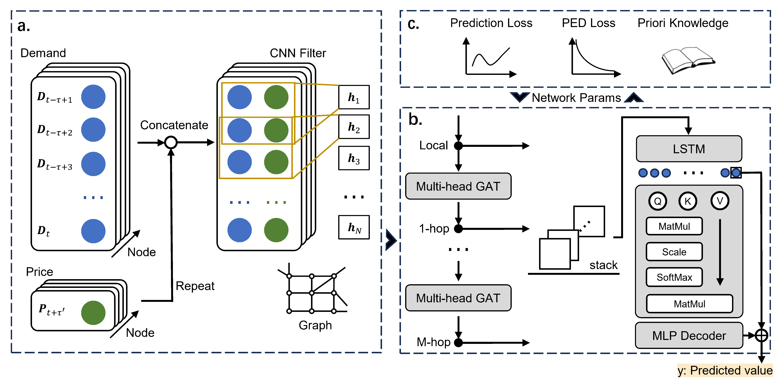
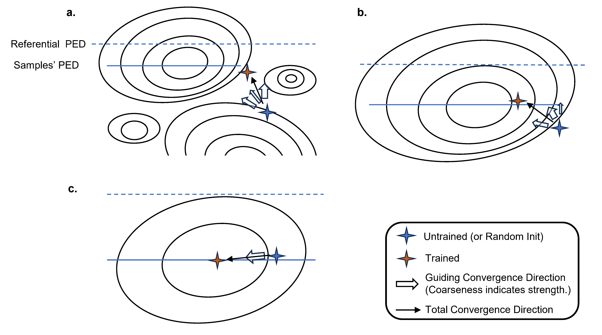
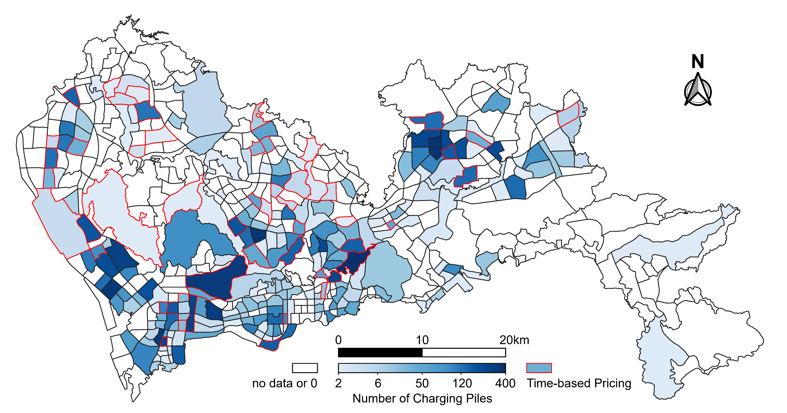

> *This markdown file was generated by Claude Code with the deepseek-v4-pro[1m] model.*

# PIAST: A Physics-Informed Graph Learning Approach for Citywide EV Charging Demand Prediction and Pricing

[_123059-blue)](https://doi.org/10.1016/j.apenergy.2024.123059)
[](LICENSE)

> **Haoxuan Kuang**<sup>1,2</sup>, Haohao Qu<sup>3</sup>, Kunxiang Deng<sup>1,2</sup>, Jun Li<sup>1,2*</sup>  
> <sup>1</sup> School of Intelligent Systems Engineering, Sun Yat-sen University  
> <sup>2</sup> Guangdong Provincial Key Laboratory of Intelligent Transportation System, Sun Yat-sen University  
> <sup>3</sup> Department of Computing, Hong Kong Polytechnic University  
> *Corresponding author*

---

## Overview

PIAST is a **physics-informed spatio-temporal graph learning framework** for citywide electric vehicle (EV) charging demand prediction and data-driven pricing. It addresses two critical gaps in existing deep learning approaches:

1. **Spillover effect modeling** — When the charging price changes in one urban area, how does the demand in neighboring areas respond?
2. **Economic interpretability** — Can we make a neural network understand and obey economic laws (e.g., *demand falls when price rises*), rather than learning spurious correlations from observational data?

PIAST integrates **convolutional feature engineering**, **spatio-temporal dual attention**, and **physics-informed neural network (PINN) training** into a unified, interpretable framework.

<p align="center">
  
</p>

---

## Key Features

- 🧩 **2D-CNN Feature Fusion** — Fuses historical demand sequences with future price information to enable cross-feature extraction and spillover-aware propagation.
- 🌐 **Spatial Attention (Multi-head GAT)** — Captures complex spatial correlations and spillover effects across 247 charging areas via multi-head graph attention.
- ⏳ **Temporal Attention (LSTM + Scaled Dot-Product)** — Extracts long-range temporal dependencies with memory effects and adaptive attention weighting.
- ⚛️ **Physics-Informed Training** — A novel three-step paradigm (pre-training → prompting → fine-tuning) that embeds the economic law of **price elasticity of demand (PED)** into the learning process, making the model both accurate and interpretable.

---

## Three-Step PINN Training

| Step | Loss Function | Purpose |
|------|--------------|---------|
| **Pre-training** | `L_pred + L_elas + λ₁L_ref` | Strong physics guidance; model learns the given price-demand law |
| **Prompting** | `L_pred + L_elas + λ₂L_ref` (λ₂ ≪ λ₁) | Weak guidance; model uncovers the **intrinsic PED** of each area |
| **Fine-tuning** | `L_pred` only | Fast convergence to high-accuracy predictions with frozen PINN parameters |

<p align="center">
  
</p>

---

## Dataset

| Item | Description |
|------|-------------|
| **Location** | Shenzhen, China |
| **Charging Piles** | 18,061 (2,056 fast-charging, 16,005 slow-charging) |
| **Study Areas** | 247 (out of 532 total in Shenzhen) |
| **Time Period** | June 19 – July 18, 2022 (30 days) |
| **Sampling Interval** | 5 minutes (8,640 timestamps) |
| **Train / Test Split** | 7:3 in chronological order |

<p align="center">
  
</p>

---

## Results

### Comparison with Baselines

PIAST is compared against **9 representative models**: MA, Lasso, FCNN, GCN, GAT, LSTM, TGCN, BEGAN, and our previous work **PAG**.

| Model | RMSE (×10⁻²) | MAPE (×10⁻²) | MAE (×10⁻²) | RAE (×10⁻²) |
|-------|-------------|-------------|-------------|-------------|
| MA | 6.17 | 17.57 | 2.80 | 23.59 |
| Lasso | 4.91 | 15.51 | 2.32 | 21.41 |
| FCNN | 5.17 | 13.01 | 2.23 | 20.48 |
| GCN | 5.63 | 17.79 | 2.91 | 23.73 |
| GAT | 5.04 | 12.82 | 2.11 | 20.00 |
| LSTM | 5.32 | 18.05 | 2.48 | 21.31 |
| TGCN | 5.24 | 16.05 | 2.66 | 22.11 |
| BEGAN | 4.99 | 12.25 | 2.05 | 19.80 |
| PAG | 5.03 | 11.33 | 2.01 | 19.65 |
| **PIAST** | **4.65** | **10.37** | **1.64** | **18.04** |

> ✅ **14.78%** average improvement over all baselines across four metrics.  
> ✅ **8.00%** improvement over our prior model PAG.

### Ablation Study

Ablation experiments demonstrate the contribution of each module: removing the PINN module, temporal attention, CNN, or GAT leads to consistent performance degradation, validating the necessity of each component.

### Price Adjustment Experiments

The model is tested under simulated price changes to evaluate its economic fidelity:

- **Self-influence effect**: Demand in area *i* consistently decreases when its own price increases, conforming to the learned PED.
- **Spillover effect**: When price rises in area *i*, demand in neighboring areas *increases* due to drivers switching to cheaper alternatives — demonstrating that the model captures real-world substitution behavior.

---


### Configuration


| Parameter | Default | Description |
|-----------|---------|-------------|
| `window_size` | 12 | Temporal window size (12 = 60 min) |
| `num_heads` | 4 | GAT multi-head attention heads |
| `num_gat_layers` | 2 | Stacked GAT layers (2-hop neighbors) |
| `ref_elasticity` | -0.45 | Referential PED (from literature) |
| `batch_size` | 1024 | Mini-batch size |
| `learning_rate` | 0.001 | Optimizer learning rate |

---

## Citation

If you find this work useful, please cite our paper:

```bibtex
@article{kuang2024piast,
  title   = {A physics-informed graph learning approach for citywide electric vehicle
             charging demand prediction and pricing},
  author  = {Kuang, Haoxuan and Qu, Haohao and Deng, Kunxiang and Li, Jun},
  journal = {Applied Energy},
  volume  = {363},
  pages   = {123059},
  year    = {2024},
  doi     = {https://doi.org/10.1016/j.apenergy.2024.123059}
}
```

---

## License

This project is licensed under the MIT License — see the [LICENSE](LICENSE) file for details.

---

## Acknowledgements

This research was supported by the National Natural Science Foundation of China and the Guangdong Provincial Key Laboratory of Intelligent Transportation System.
